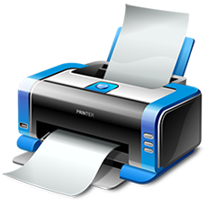

# Modeling Objects with OOP

## The Printing Machine

Congratulations!!! you’ve just got hired by Printer Software Corporation (PSC).  This company objective is to write automated software for printers. This software will change the process of operating printers and make printers independent.



## For Context

The following are the features of a printer machine we are to model

- Ability to print in two colours (greyscale and coloured)
- It’s money operated
- It’s interactive

The Printing machine should be able to print both in greyscale and coloured format depending on the user’s choice and each of them requires a different quantity of ink and also has a different price.

We are going to be modelling all this data in our printing machine program as well, but luckily for you in the starting code, I have already included all of this data inside a dictionary.
Also, the printer machine has some resources that it has to manage, so it starts with 500ml of ink, 100pc of paper and #0 as  initial profit.

The second feature of our printer machine is that its money operated, so we are going to be using four Nigerian Notes which are going to be called with their street name, they are the Biyar, the Faiba, the Muri, and the Wazobia. Notice what each of these are worth. The Biyar worth(#5), the Faiba worth( #10), the Muri worth (#20) and the Wazobia worth (#50).

## Expectations & Requirements

Using an object-oriented programming paradigm in python, you are to model a printer machine described above and at least should meet the following requirements.

### Prompt user by asking `What format would you like? ( coloured or grayscale )`

- Check the user’s input to decide what to do next.

### Turn off the Printing Machine by entering `off` to the prompt

- For maintainers of the printing machine, they can use `off` as the secret word to turn off the machine. Your code should end execution when this happens

### Print Report

- When the user enters `report` to the prompt, a report should be generated that shows current resource values
  
### Check resources sufficient?

- When the user chooses a type to print and the number of pages to print, the program should check if there are enough resources to print.
- E.g. if Coloured requires 7ml ink per page and 20 pages is to be printed but there is only 100ml left in the machine. It should not continue to print but return: `Sorry there is not enough ink.`
- The same should happen if another resource is depleted, e.g. paper.

### Process Price

- If there are enough resources, the program should process the amount of money it will cost the user and print: Your price is #300
- Then prompt the user to insert the quantity of the accepted 4 currency notes in order

### Check Transaction

- Check that the user has inserted enough money for the service. E.g If the price cost #300 but they only inserted #200 then the program should say `Sorry that’s not enough money. Money refunded`
- But if the user has inserted enough money, then the price gets added to the machine as the profit and this will be reflected the next time `report` is triggered. E.g.
  
  ```python
    paper: 100pc
    ink: 100ml
    profit: #500
  ```

- If the user has inserted more money than the actual price, the machine should offer change. E.g. `Here is #100 Naira in change.` 

### Print User Project

- If the transaction is successful and there enough resources, then the resources to print the project should be deducted from the printing machine.

Eg. report before printing the project

  ```python
    paper: 100pc
    ink: 50ml
    profit: #500
  ```

Report after printing the project

  ```python
    paper: 10pc
    ink: 5ml
    profit: #900
  ```

- Once all the resources have been deducted, tell the user `Here is your Project.` and `Thank you for using our services`
